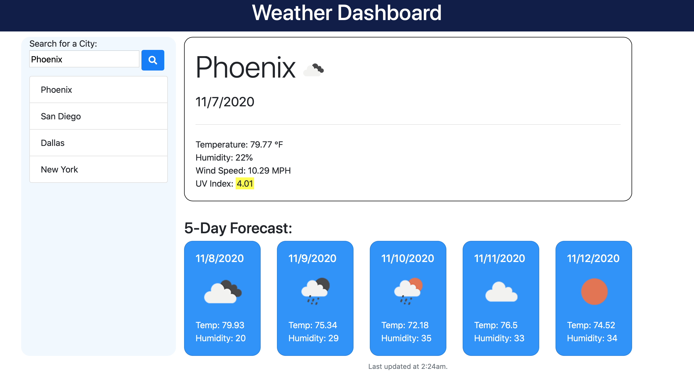

# SMU Homework 05: Day Planner

Create a simple calendar application that allows a user to save events for each hour of the day by modifying starter code. This app will run in the browser and feature dynamically updated HTML and CSS powered by jQuery.

## Description

Our fifth homework assignment was to create a day planner. You can skip straight to the final product by clicking [here](https://djfriar.github.io/SMU-Homework-05-Day-Planner/).

For full details on the assignment, please [view the assignment](ASSIGNMENT.md).

## Installation

This site is a standard HTML, CSS, and JS site. To install you can clone the repo and then double-click on index.html.

## Usage

## Credits

- Local Storage: [MDN Web Docs](https://developer.mozilla.org/en-US/docs/Web/API/Window/localStorage)
- jQuery: [W3Schools.com](https://www.w3schools.com/jquery/default.asp)

## License

This content can be reused for personal educational purposes only. No commerical use is authorized.
